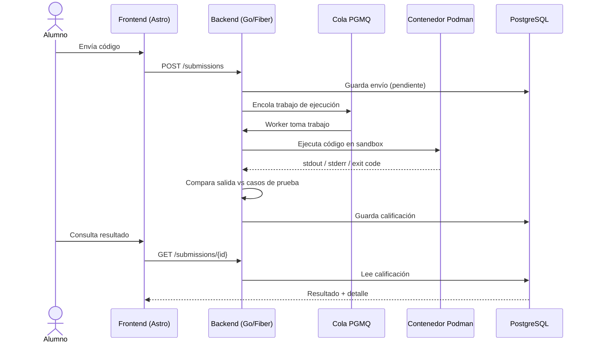
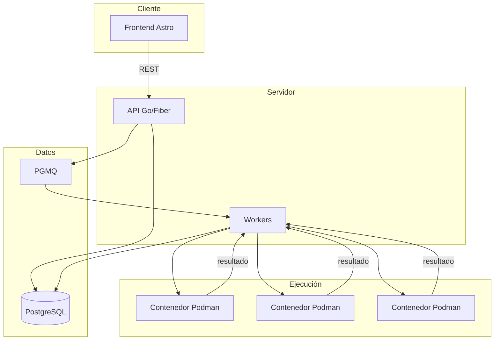

# AutoGrader IPN

Plataforma de calificación automática de código para el Instituto Politécnico Nacional.

Los profesores crean tareas de programación, los alumnos envían su código y el sistema lo ejecuta en contenedores aislados, evalúa los resultados contra casos de prueba y asigna una calificación — todo de forma automática.

## Stack tecnológico

| Capa | Tecnología |
|------|-----------|
| Backend | Go + Fiber |
| Frontend | Astro + TypeScript |
| Base de datos | PostgreSQL + PGMQ |
| Contenedores | Podman |
| Queries | sqlc + golang-migrate |

## Flujo de calificación

## Arquitectura general

## Fases del proyecto

**Fase 1** — Servidor centralizado. Un solo servidor ejecuta los contenedores de forma local.
**Fase 2** — Agentes distribuidos. Las computadoras de los profesores actúan como nodos de ejecución con fallback al servidor central.
